<h1 align="center">📚 React 개인 프로젝트 - 롯데호텔 이숍 클론</h1>

React, Redux Toolkit, CSS 기반으로 구현한 쇼핑몰형 동적 웹 프로젝트

 

## 📌 목차

- 개요
- 기술 스택
- 주요 기능
- 기능 구현 PPT
- 프로젝트 리뷰
- 개선사항

## 📖 개요

- 프로젝트 목표 : 롯데호텔 이숍 쇼핑몰 UI를 참고하여 메인, 상품 목록, 상품 상세, 장바구니 흐름을 구현한 React 웹 애플리케이션
- 개발 기간 : 2026/03/31 ~ 2026/04/07
- 배포 주소 : [GitHub Pages](https://bluebeatle97.github.io/LotteHotelEShopCopy)

## 🛠️ 기술 스택

- Language : `HTML`, `CSS`, `JavaScript`
- Framework / Library : `React`, `React Router DOM`, `Redux Toolkit`, `React Redux`
- Styling : `CSS3 (순수 CSS)`, `Swiper`
- Data : `Local JS Mock Data`
- Tool : `Visual Studio Code`, `Figma`
- ETC : `Git`, `GitHub`, `GitHub Pages`

## ✨ 주요 기능

- 메인 페이지 : 메인 비주얼 슬라이더, 퀵 메뉴, 베스트 상품, 리뷰, 이벤트, 멤버십 혜택 섹션 구성
- 상품 목록 : 카테고리별 상품 출력, 소분류 필터, 상품명 검색, 가격/이름 정렬, 페이지네이션 구현
- 상품 상세 : 썸네일 이미지 전환, 수량 선택, 총 금액 계산, 상품 설명/배송/리뷰/문의 탭 구현
- 장바구니 : Redux Toolkit으로 장바구니 상태 관리, 동일 상품 수량 합산, 수량 변경/삭제, 총 금액 계산 구현
- 데이터 유지 : `localStorage`를 활용하여 새로고침 후에도 장바구니 데이터 유지
- 라우팅 : `React Router DOM`으로 메인, 카테고리, 상세, 장바구니 페이지 이동 처리

## 🖥️ 기능 구현 PPT

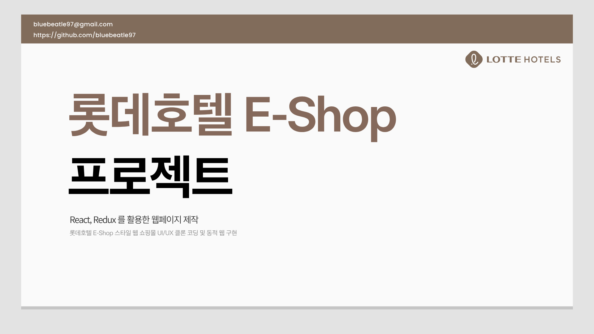

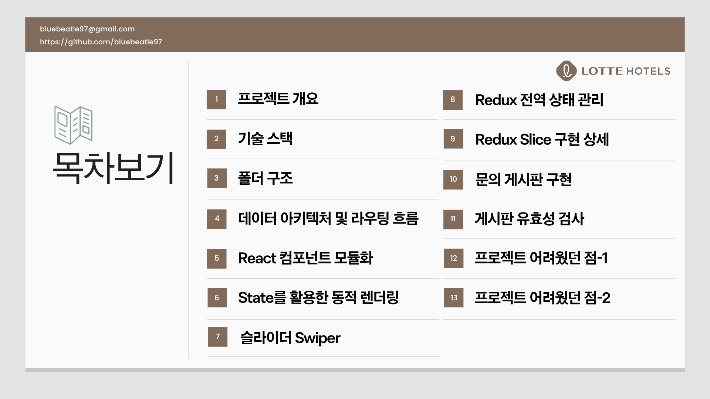

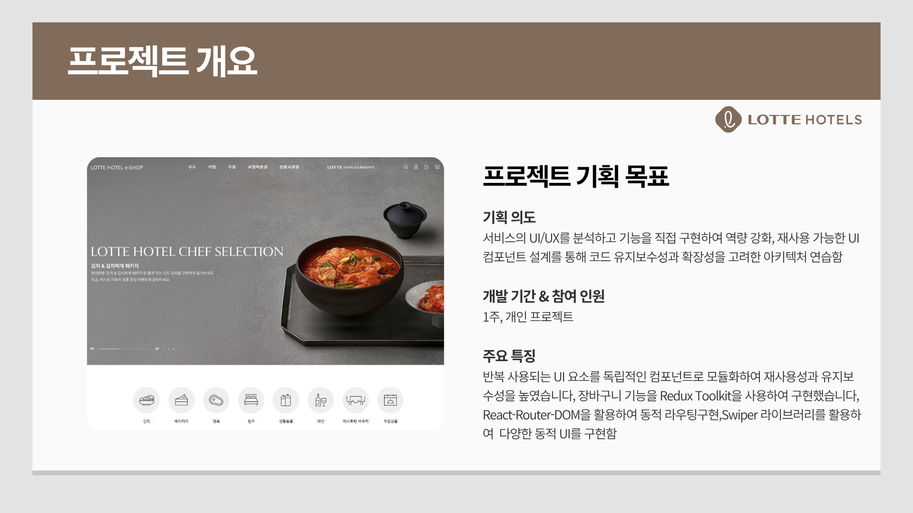

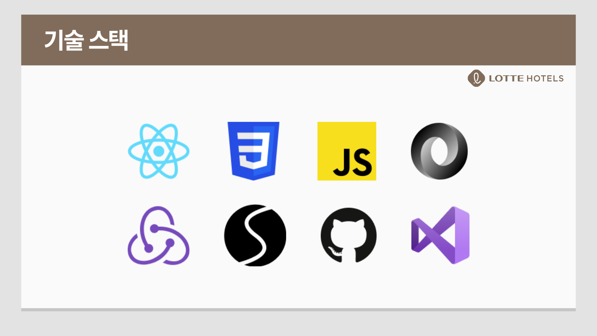

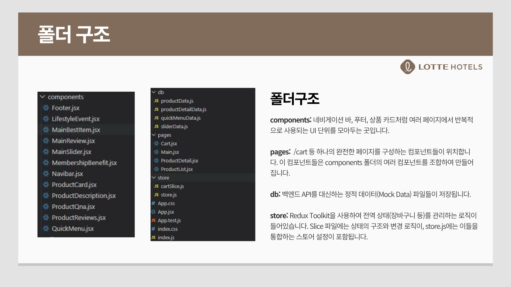

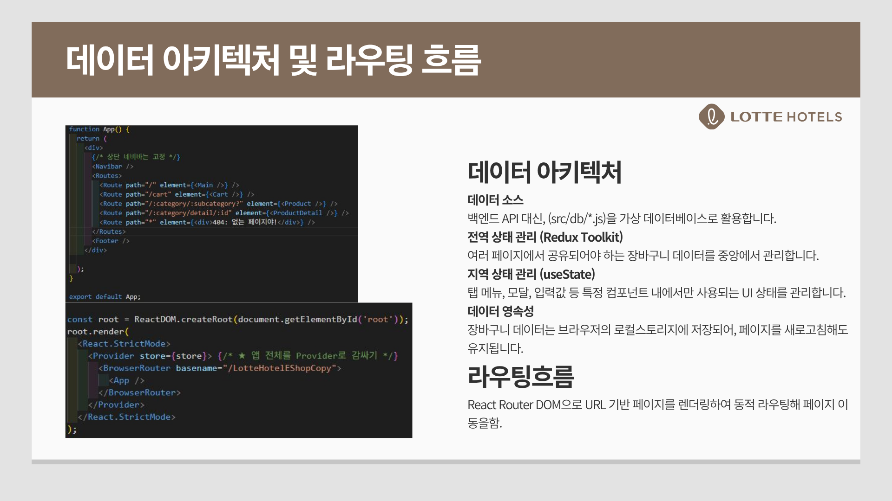

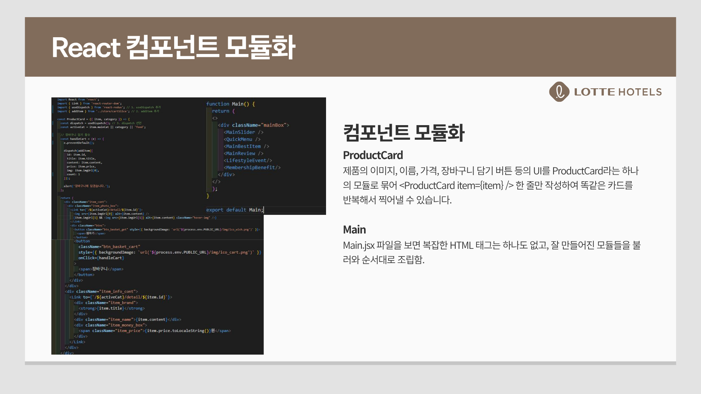

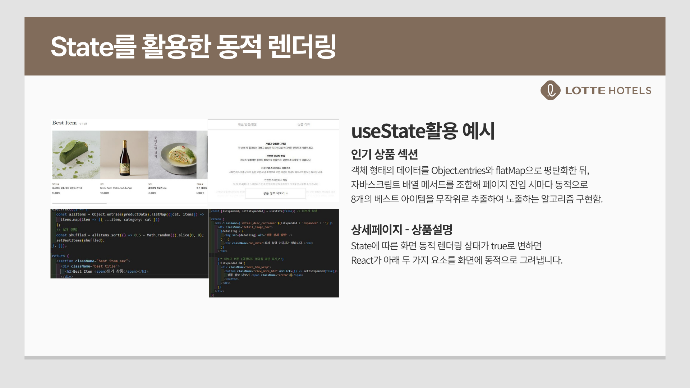

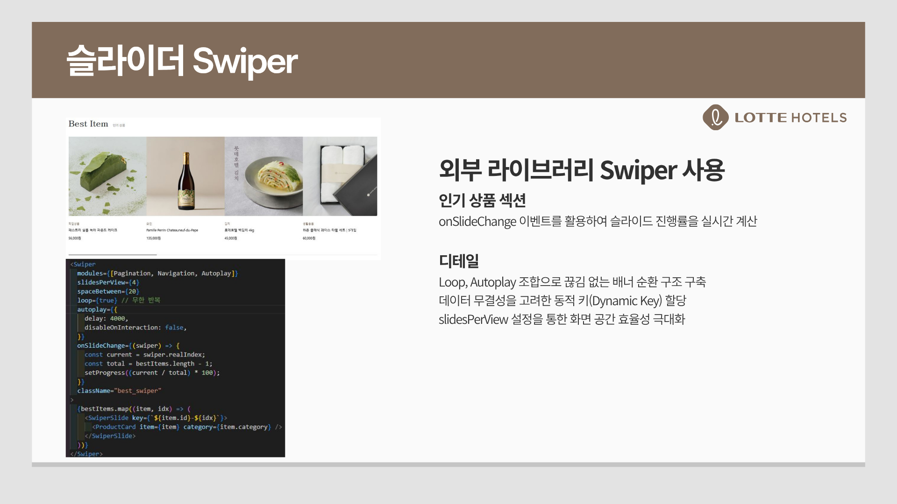

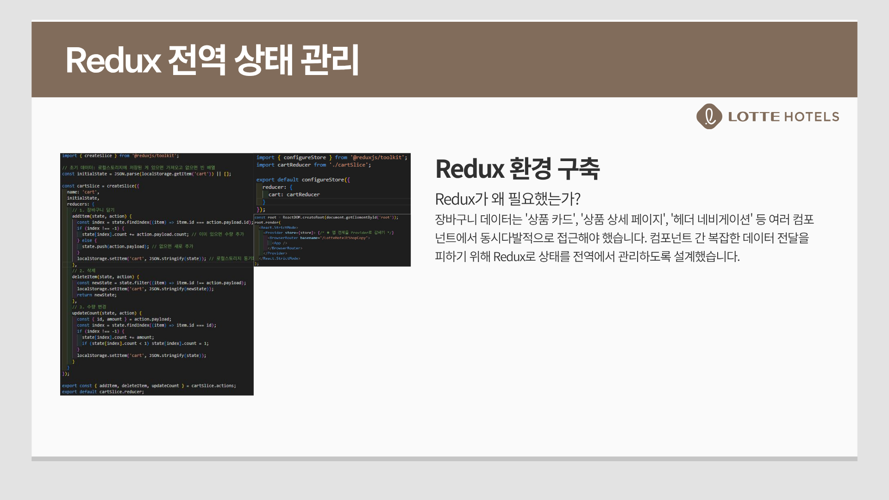

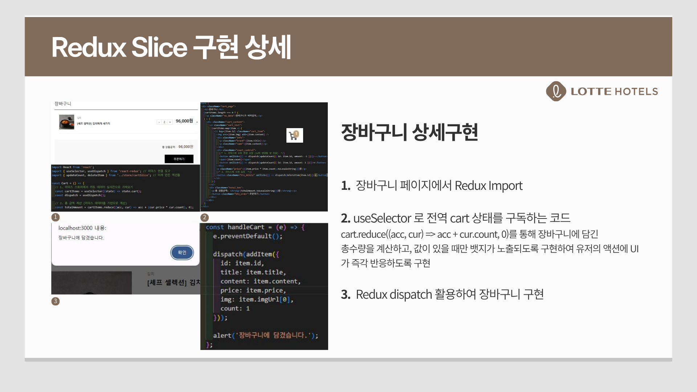

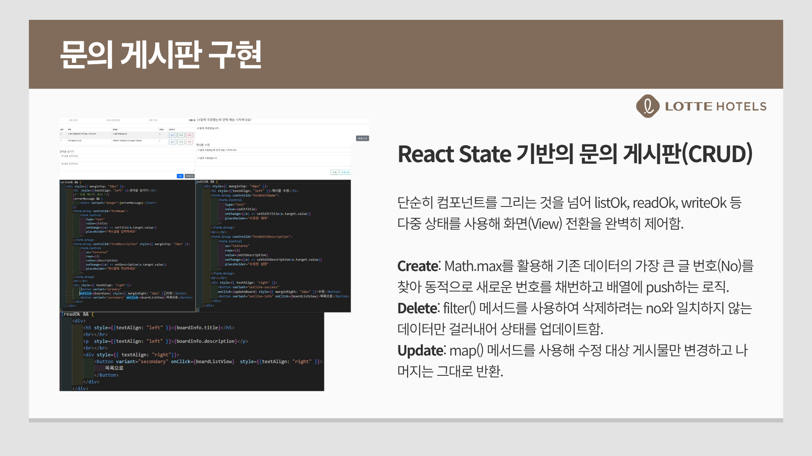

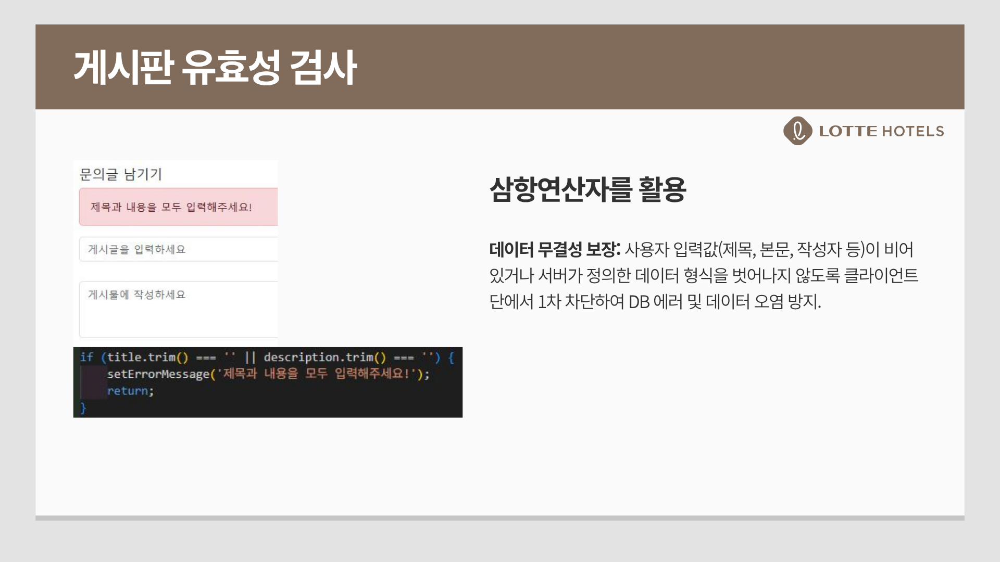

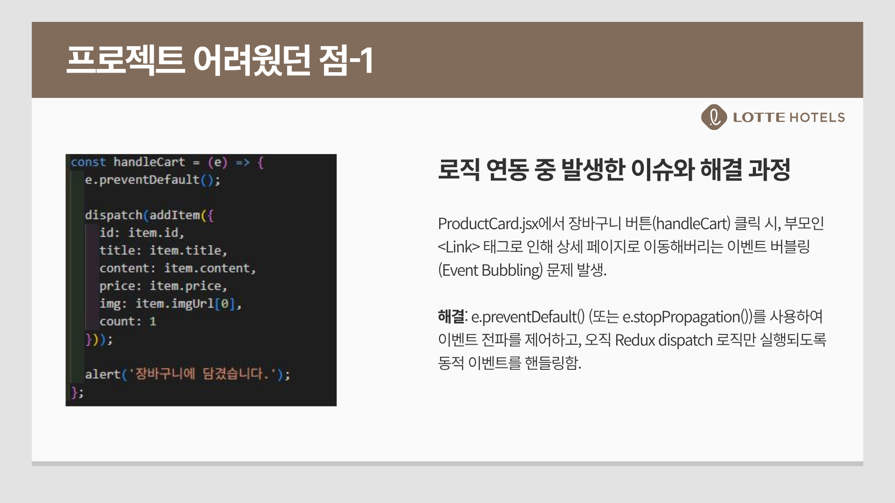

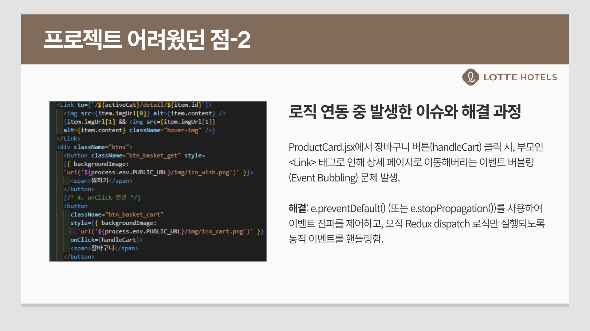

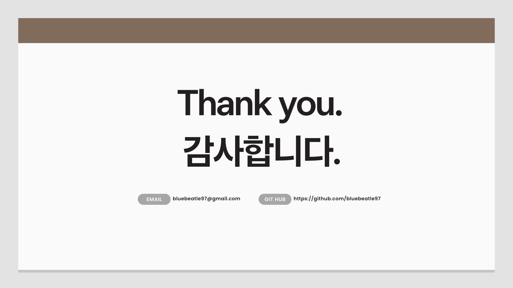

## 🔎 프로젝트 리뷰

<b>1. 컴포넌트 기반 구조 적용</b>: 메인, 상품 카드, 상품 설명, 리뷰, Q&A, 네비게이션, 푸터 등 화면 단위를 컴포넌트로 분리하여 React 프로젝트의 기본 구조를 잘 잡았습니다.

<b>2. 쇼핑몰 핵심 플로우 구현</b>: 상품 탐색, 상세 확인, 수량 선택, 장바구니 담기, 장바구니 수량 변경과 삭제까지 실제 커머스 서비스의 기본 사용자 흐름을 구현했습니다.

<b>3. 상태 관리 경험 확보</b>: Redux Toolkit과 `localStorage`를 함께 사용하여 장바구니 상태를 전역으로 관리하고, 새로고침 후에도 데이터를 유지하도록 구성했습니다.

<b>4. 개선이 필요한 부분</b>: 일부 컴포넌트에 UI와 로직이 함께 몰려 있고, 접근성 경고가 남아 있습니다. 또한 Mock Data를 직접 import하는 구조라 실제 API 연동 상황에 대한 로딩/에러 처리가 아직 부족합니다.

## 🚀 개선사항

<b>1. 컴포넌트 분리 및 모듈화</b>: 현재 `ProductDetail.jsx`에 이미지 슬라이더, 상품 정보, 수량 선택, 탭 UI, 배송/반품 안내가 함께 들어 있어 컴포넌트가 비대해질 수 있습니다. `ProductImageGallery`, `ProductInfo`, `ProductTabs`, `ExchangeGuide`처럼 역할별 하위 컴포넌트로 분리하여 가독성과 유지보수성을 높이겠습니다.

<b>2. 비동기 통신(API) 적용 및 UX 개선</b>: 현재 상품 데이터는 로컬 Mock Data를 직접 import하고 있습니다. 이후에는 `fetch` 또는 `axios` 기반의 API 호출 구조로 전환하고, 로딩 중 스켈레톤 UI와 에러 메시지를 제공하여 실제 서비스와 가까운 사용자 경험을 구현하겠습니다.

<b>3. 접근성 및 시맨틱 마크업 개선</b>: `href`가 없는 `<a>` 태그로 인해 빌드 시 접근성 경고가 발생합니다. 페이지 이동은 `Link` 컴포넌트로, 클릭 동작만 있는 요소는 `<button>`으로 변경하여 키보드 접근성과 스크린 리더 대응을 개선하겠습니다.

<b>4. 웹 성능 최적화</b>: 쇼핑몰 특성상 상품 이미지가 많기 때문에 이미지 지연 로딩, WebP 포맷 적용, 이미지 사이즈 최적화, 불필요한 렌더링 감소를 통해 초기 로딩 속도를 개선하겠습니다.

<b>5. 타입 안정성 강화</b>: 상품, 리뷰, 장바구니처럼 구조가 있는 데이터가 많기 때문에 TypeScript를 도입하여 데이터 타입을 명확히 정의하고 런타임 에러를 줄이겠습니다.

<b>6. 코드 품질 정리</b>: 미사용 변수와 미사용 import를 제거하고, `useEffect` 의존성 경고를 해결하며, `console.log`와 테스트용 주석을 정리하여 배포용 코드 품질을 높이겠습니다.
